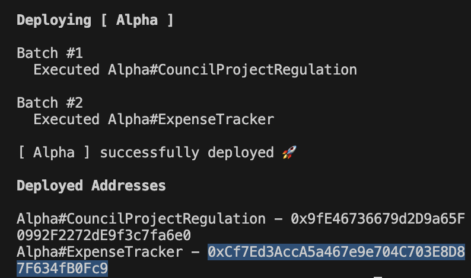

# Info
> Backend repository for Jacob Noar Undergraduate Disserataion 

> Please find the Frontend Repository [here](https://github.com/CodeDann/fyp-frontend)

# Instructions for use

## Requirements
1. Make
2. npm
## Running the applicaiton
1.  From root directory run the command
    ```console
    make start-node
    ```
    This starts the hardhat network and provides accounts preloaded with ether to use in the application

2. Open a new console window and run
    ```console
    make deploy
    ```
    This will compile, test, and deploy the smart contracts needed for the application to function to the node we just created.
    > Note this can take some time ( 2+ mins )

3. After the contracts have been deployed the address of the ExpenseTracker contract should be logged in the console. Copy this as it is needed to interact with the application.

    See here for an example. 
    
    

4. Run the commmand
    ```console
    make start-backend
    ```
    This will start the backend Express server that allows communication between the Frontend React Web App and the contracts deployed on Chain

5. Start the Frontend. [See here](https://github.com/CodeDann/fyp-frontend)
  

## Documentation
> FYP-Backend/documentation houses all public documentation for the project

### Architecture diagram

### Use case diagram
